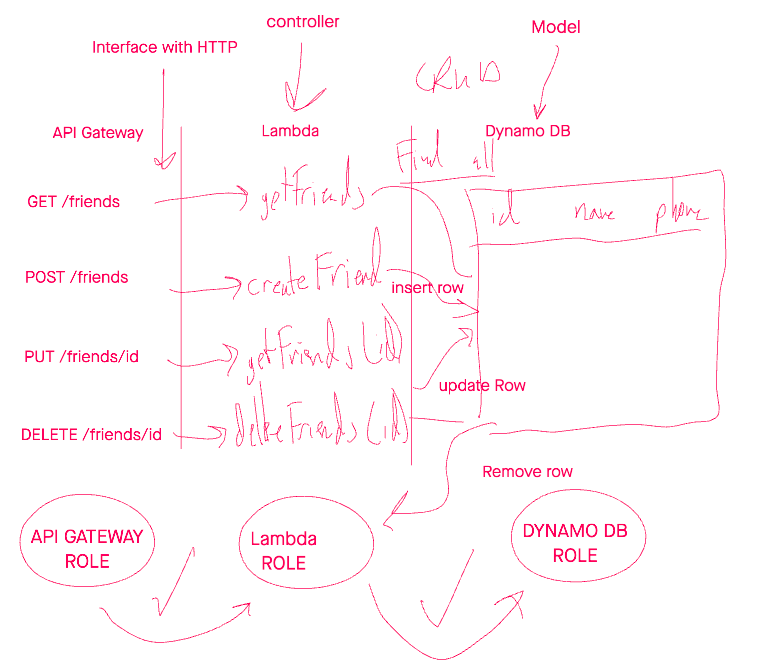

# serverless-api


An api created within the AWS ecosystem

## UML


## API

### `/people`

#### `GET`

Returns all the records in the database

Status code: 200

Inputs: none

* JSON Output:
  * statusCode: NUMBER
  * body: ARRAY

```JS
{
  "statusCode": 200,
  "body": "[{\"id\":\"2\",\"name\":\"Damian Lillard\",\"phone\":\"(222) 222-2222\"},{\"id\":\"3\",\"name\":\"Roger Ebert\",\"phone\":\"(000) 000-0000\"}]"
}
```

#### `POST`

Creates a single record in the database

Status code: 201

* JSON Input:
  * id: STRING, unique
  * name: STRING
  * phone: STRING

*JSON output:
  *id: STRING, unique
  *name: STRING
  *phone: STRING

```JS
{
  "id": "4",
  "name": "Dion Johnson",
  "phone": "(666) 666-6666"
}
```

### `people/:id`

#### `PUT`

Updates a single record in the database

pathParameters: id, NUMBER

Status code: 204

* JSON Input:
  * id: STRING, unique
  * name: STRING
  * phone: STRING

* JSON output:
  * id: STRING, unique
  * name: STRING
  * phone: STRING

```JS
{
  "id": "4",
  "name": "Dion Johnson",
  "phone": "(666) 666-6666"
}
```

#### `GET`

Returns a single record at a given id

pathParameters: id, NUMBER

Status code: 200

* JSON output:
  * id: STRING, unique
  * name: STRING
  * phone: STRING

```JS
{
  "id": "4",
  "name": "Dion Johnson",
  "phone": "(666) 666-6666"
}
```

### `Delete`

Deletes a single record at a given id

Status code: 203

pathParameters: id, NUMBER
